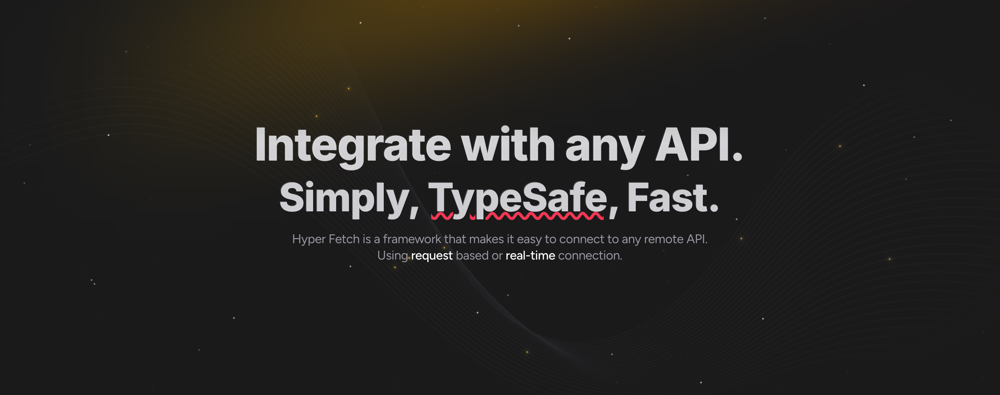

<h1 align="center">



</h1>

<div align="center">

Framework for fetching and realtime data exchange.

**[Documentation](https://hyperfetch.bettertyped.com/) |
[Quick Start](https://hyperfetch.bettertyped.com/docs/documentation/getting-started/quick-start) |
[Guides](https://hyperfetch.bettertyped.com/docs/guides/Basic/Setup)**

</div>

<div align="center">
  <a href="https://bettertyped.com/">
    
  </a>
  <a href="https://github.com/BetterTyped/hyper-fetch">
    
  </a>
  <a href="https://github.com/BetterTyped/hyper-fetch/blob/main/License.md">
    
  </a>
  <a href="https://github.com/semantic-release/semantic-release">
    
  </a>
  <a href="https://api.codeclimate.com/v1/badges/eade9435e75ecea0c004/test_coverage">
    
  </a>
  <a href="https://bestofjs.org/projects/hyper-fetch" rel="nofollow">
    
  </a>
</div>

<br />

**`Hyper Fetch`** is unique fetching and realtime data-exchange framework meticulously crafted to **prioritize
simplicity and efficiency**. Its **typesafe design** and **user-friendly interface** ensure a seamless integration
experience, whether you're working on the browser or the server. Next-generation features streamlines architecture
creation, grants access to the request lifecycle, and empowers rapid development of new components and functionalities,
all while facilitating **real-time data exchange**.

---

<p align="center">
	<a href="https://github.com/sponsors/prc5?tier=platinum">
		<picture>
			
		</picture>
	</a>
</p>

<p align="center">
	<a href="https://github.com/sponsors/prc5?tier=Platinum">
		<picture>
			
		</picture>
	</a>
</p>

## Key Features

🔮 **Simple setup** - [Read more](https://hyperfetch.bettertyped.com/docs/guides/basic/setup)

🎯 **Easy cancellation** - [Read more](https://hyperfetch.bettertyped.com/docs/guides/Advanced/Cancellation)

✨ **Deduplicate similar requests** -
[Read more](https://hyperfetch.bettertyped.com/docs/guides/advanced/deduplication/)

🚀 **Queueing** - [Read more](https://hyperfetch.bettertyped.com/docs/guides/advanced/queueing)

💎 **Response Caching** - [Read more](https://hyperfetch.bettertyped.com/docs/documentation/core/cache)

🔋 **Offline First** - [Read more](https://hyperfetch.bettertyped.com/docs/guides/advanced/offline)

📡 **Built-in fetcher** - [Read more](https://hyperfetch.bettertyped.com/docs/documentation/core/adapter)

🎟 **Authentication** - [Read more](https://hyperfetch.bettertyped.com/docs/guides/basic/authentication)

🔁 **Smart Retries** - [Read more](https://hyperfetch.bettertyped.com/docs/guides/basic/retries/)

## Help me keep working on this project ❤️

- [Become a Sponsor on GitHub](https://github.com/sponsors/prc5)

## Installation

The easiest way to get the latest version of Hyper Fetch is to install it via yarn or npm.

#### [Core](https://hyperfetch.bettertyped.com/docs/documentation/core/overview)

```bash
npm install --save @hyper-fetch/core
or
yarn add @hyper-fetch/core
```

#### [Sockets](https://hyperfetch.bettertyped.com/docs/documentation/sockets/overview)

```bash
npm install --save @hyper-fetch/sockets
or
yarn add @hyper-fetch/sockets
```

#### [React](https://hyperfetch.bettertyped.com/docs/documentation/react/overview)

```bash
npm install --save @hyper-fetch/core @hyper-fetch/react
or
yarn add @hyper-fetch/core @hyper-fetch/react
```

<p align="center">
	<a href="https://github.com/sponsors/prc5?tier=Gold">
		<picture>
			
		</picture>
	</a>
</p>

<p align="center">
	<a href="https://github.com/sponsors/prc5?tier=gold">
		<picture>
			
		</picture>
	</a>
</p>

## Packages

<table>
  <thead>
    <tr>
      <th>Package</th>
      <th>Stats</th>
    </tr>
  </thead>
  <tbody>
    <tr>
      <td>
        <a href="https://github.com/BetterTyped/hyper-fetch/tree/main/packages/core">Hyper Fetch</a>
      </td>
      <td>
        <a href="https://www.npmjs.com/package/@hyper-fetch/core">
          
        </a>
        <a href="https://www.npmjs.com/package/@hyper-fetch/core">
          
        </a>
        <a href="https://www.npmjs.com/package/@hyper-fetch/react">
          
        </a>
      </td>
    </tr>
    <tr>
      <td>
        <a href="https://github.com/BetterTyped/hyper-fetch/tree/main/packages/sockets" >Sockets</a>
      </td>
      <td>
        <a href="https://www.npmjs.com/package/@hyper-fetch/sockets">
          
        </a>
        <a href="https://www.npmjs.com/package/@hyper-fetch/sockets">
          
        </a>
        <a href="https://www.npmjs.com/package/@hyper-fetch/sockets">
          
        </a>
      </td>
    </tr>
    <tr>
      <td>
        <a href="https://github.com/BetterTyped/hyper-fetch/tree/main/packages/react" >React </a>
      </td>
      <td>
        <a href="https://www.npmjs.com/package/@hyper-fetch/react">
          
        </a>
        <a href="https://www.npmjs.com/package/@hyper-fetch/react">
          
        </a>
        <a href="https://www.npmjs.com/package/@hyper-fetch/react">
          
        </a>
      </td>
    </tr>
    <tr>
      <td>
        <a href="https://github.com/BetterTyped/hyper-fetch/tree/main/packages/adapter-firebase" >Firebase</a>
      </td>
      <td>
        <a href="https://www.npmjs.com/package/@hyper-fetch/firebase">
          
        </a>
        <a href="https://www.npmjs.com/package/@hyper-fetch/firebase">
          
        </a>
        <a href="https://www.npmjs.com/package/@hyper-fetch/firebase">
          
        </a>
      </td>
    </tr>
    <tr>
      <td>
        <a href="https://github.com/BetterTyped/hyper-fetch/tree/main/packages/adapter-firebase-admin" >Firebase Admin</a>
      </td>
      <td>
        <a href="https://www.npmjs.com/package/@hyper-fetch/firebase-admin">
          
        </a>
        <a href="https://www.npmjs.com/package/@hyper-fetch/firebase-admin">
          
        </a>
        <a href="https://www.npmjs.com/package/@hyper-fetch/firebase-admin">
          
        </a>
      </td>
    </tr>
    <tr>
      <td>
        <a href="https://github.com/BetterTyped/hyper-fetch/tree/main/packages/adapter-graphql" >GraphQL</a>
      </td>
      <td>
        <a href="https://www.npmjs.com/package/@hyper-fetch/graphql">
          
        </a>
        <a href="https://www.npmjs.com/package/@hyper-fetch/graphql">
          
        </a>
        <a href="https://www.npmjs.com/package/@hyper-fetch/graphql">
          
        </a>
      </td>
    </tr>
    <tr>
      <td>
        <a href="https://github.com/BetterTyped/hyper-fetch/tree/main/packages/adapter-axios" >Axios</a>
      </td>
      <td>
        <a href="https://www.npmjs.com/package/@hyper-fetch/axios">
          
        </a>
        <a href="https://www.npmjs.com/package/@hyper-fetch/axios">
          
        </a>
        <a href="https://www.npmjs.com/package/@hyper-fetch/axios">
          
        </a>
      </td>
    </tr>
    <tr>
      <td>
        <a href="https://github.com/BetterTyped/hyper-fetch/tree/main/packages/codegen-openapi" >Axios</a>
      </td>
      <td>
        <a href="https://www.npmjs.com/package/@hyper-fetch/codegen-openapi">
          
        </a>
        <a href="https://www.npmjs.com/package/@hyper-fetch/codegen-openapi">
          
        </a>
        <a href="https://www.npmjs.com/package/@hyper-fetch/codegen-openapi">
          
        </a>
      </td>
    </tr>
  </tbody>
</table>

## Examples

#### Simple Setup

```tsx
import { Client } from "@hyper-fetch/core";

// Setup our connection to the server
export const client = new Client({ url: "http://localhost:3000" });

// Create reusable requests for later use
export const postData = client.createRequest<ResponseType, RequestType, LocalErrorType, QueryParamsType>()({
  method: "POST",
  endpoint: "/data/:accountId",
});

export const getData = client.createRequest<ResponseType, RequestType, LocalErrorType, QueryParamsType>()({
  method: "GET",
  endpoint: "/user",
});
```

#### Fetching

Executing previously prepared requests is very simple. We can do this using the send method.

```ts
const { data, error, status } = await getData.send();
```

#### Mutation request

We can attach the data to the request with methods before sending it to the server. This is helpful for building our
request and attaching data to it which can be helpful when we need to create it in a few steps from data obtained during
some process.

```ts
// Set the information to request (methods return request clone - NOT mutating the source)
const request = postData
  .setParams({ accountId: 104 }) // Set Params
  .setQueryParams({ paramOne: "test", paramTwo: "test2" })
  .setData({ name: "My new entity", description: "Some description" }) // Add payload data
  .send();
```

We can also pass them directly to the send method, which will add them to the request at once.

```ts
// OR pass dynamic data directly to '.send' method
const { data, error, status } = await postData.send({
  params: { accountId: 104 },
  data: { name: "My new entity", description: "Some description" },
  queryParams: { paramOne: "test", paramTwo: "test2" },
});
```

<p align="center">
	<a href="https://github.com/sponsors/prc5?tier=Silver">
		<picture>
			
		</picture>
	</a>
</p>

<p align="center">
	<a href="https://github.com/sponsors/prc5?tier=Silver">
		<picture>
			
		</picture>
	</a>
</p>

### React

#### Fetch with lifecycle

<details>
    <summary>Show me example</summary>

```tsx
import { useFetch } from "@hyper-fetch/react";

// Lifecycle fetching
const { data, error, loading, onSuccess, onError } = useFetch(getData);

onSuccess((data) => {
  console.log(data);
});

onError((error) => {
  console.log(error);
});
```

</details>

#### Manually trigger requests

<details>
    <summary>Show me example</summary>

```tsx
import { useSubmit } from "@hyper-fetch/react";

const { submit, data, error, submitting, onSubmitSuccess, onSubmitError } = useSubmit(request);

onSuccess((data) => {
  console.log(data);
});

onError((error) => {
  console.log(error);
});

return <button onClick={() => submit()}>Trigger request!</button>;
```

</details>

#### Pass dynamic data to submit method

<details>
    <summary>Show me example</summary>

```tsx
import { useSubmit } from "@hyper-fetch/react";

const { submit, data, error, submitting, onSubmitSuccess, onSubmitError } = useSubmit(request);

onSuccess((data) => {
  console.log(data);
});

onError((error) => {
  console.log(error);
});

return (
  <button
    onClick={() =>
      submit({
        params: { accountId: 104 },
        data: { name: "My new entity", description: "Some description" },
        queryParams: { paramOne: "test", paramTwo: "test2" },
      })
    }
  >
    Trigger request!
  </button>
);
```

</details>

#### Use submit promise response

<details>
    <summary>Show me example</summary>

```tsx
import { useSubmit } from "@hyper-fetch/react";

// Manual triggering
const { submit, data, error, submitting, onSubmitSuccess, onSubmitError } = useSubmit(request);

onSuccess((data) => {
  console.log(data);
});

onError((error) => {
  console.log(error);
});

const handleSubmit = (values: ValuesType, { setSubmitting }: FormikHelpers) => {
  const { data, error, status } = await submit(); // Submit method returns data!
  setSubmitting(false);
  if (data) {
    notification.success("Done!", data);
  } else {
    notification.success("Error!", error);
  }
};

return <Form onSubmit={handleSubmit}>...</Form>;
```

</details>

# [Find out more examples](https://hyperfetch.bettertyped.com/docs/guides/basic/setup)

## 💖 Our sponsors

<p align="center">
	<a href="https://github.com/sponsors/prc5">
		
	</a>
</p>
