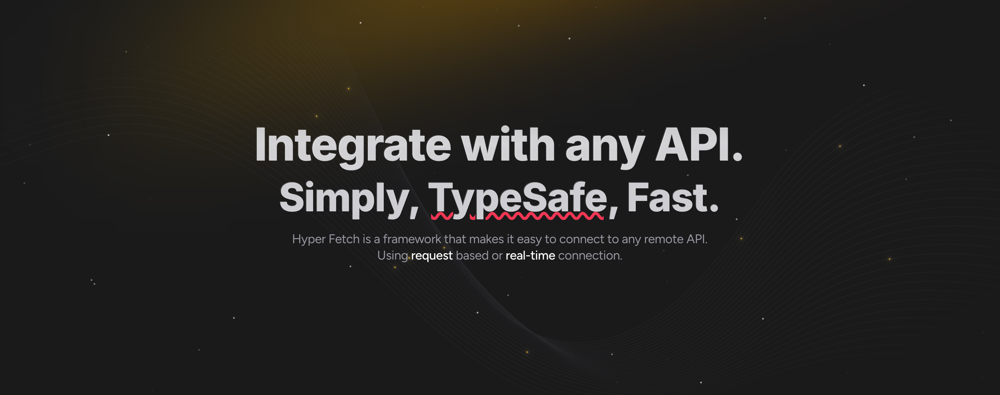

<h1 align="center">



</h1>

<div align="center">

**One SDK. Any API. Fully typed.**

The type-safe API layer for TypeScript apps. Connect to REST, GraphQL, Firebase, WebSockets, SSE — all with one consistent interface and the best type safety in the ecosystem.

**[Documentation](https://hyperfetch.bettertyped.com/) |
[Quick Start](https://hyperfetch.bettertyped.com/docs/getting-started/quick-start) |
[Guides](https://hyperfetch.bettertyped.com/docs/guides/Basic/Setup)**

</div>

<div align="center">
  <a href="https://github.com/BetterTyped/hyper-fetch">
    
  </a>
  <a href="https://github.com/BetterTyped/hyper-fetch/blob/main/License.md">
    
  </a>
  <a href="https://www.npmjs.com/package/@hyper-fetch/core">
    
  </a>
  <a href="https://www.npmjs.com/package/@hyper-fetch/core">
    
  </a>
  <a href="https://img.shields.io/bundlephobia/minzip/@hyper-fetch/core">
    
  </a>
  <a href="https://github.com/BetterTyped/hyper-fetch">
    
  </a>
</div>

<br />

## Quick Start

### Define requests manually

```ts
import { createClient } from "@hyper-fetch/core";

// Create a client — this is the single entry point for all your API calls
const client = createClient({ url: "https://api.example.com" });

// Define a typed request — response shape is inferred everywhere from here
const getUsers = client.createRequest<{ response: { id: number; name: string }[] }>()({
  endpoint: "/users",
  method: "GET",
});

// Send it — data, error, and status are fully typed
const { data, error, status } = await getUsers.send();
```

### Or generate from OpenAPI

```bash
npx @hyper-fetch/cli generate --url https://api.example.com/openapi.json
```

```ts
import { sdk } from "./generated";

// Every endpoint from your schema is available as a typed method
const { data } = await sdk.users.list.send();
```

## Why HyperFetch?

- 🔮 **Zero guesswork** — End-to-end TypeScript types from schema to response, full autocompletion, zero `any`
- 📡 **One interface for everything** — REST, GraphQL, Firebase, WebSockets, SSE — stop learning a new library for each API
- 💾 **Data management built in** — Caching, queuing, offline support, retries, and deduplication out of the box
- ⚡ **Works everywhere** — React, Next.js, Remix, Astro, Node.js, Bun — same API, every environment

---

<p align="center">
	<a href="https://github.com/sponsors/prc5">
		<picture>
			
		</picture>
	</a>
</p>

## Packages

| Package | Version | Downloads | Size |
| --- | --- | --- | --- |
| [@hyper-fetch/core](https://github.com/BetterTyped/hyper-fetch/tree/main/packages/core) | [](https://www.npmjs.com/package/@hyper-fetch/core) | [](https://www.npmjs.com/package/@hyper-fetch/core) | [](https://bundlephobia.com/package/@hyper-fetch/core) |
| [@hyper-fetch/react](https://github.com/BetterTyped/hyper-fetch/tree/main/packages/react) | [](https://www.npmjs.com/package/@hyper-fetch/react) | [](https://www.npmjs.com/package/@hyper-fetch/react) | [](https://bundlephobia.com/package/@hyper-fetch/react) |
| [@hyper-fetch/sockets](https://github.com/BetterTyped/hyper-fetch/tree/main/packages/sockets) | [](https://www.npmjs.com/package/@hyper-fetch/sockets) | [](https://www.npmjs.com/package/@hyper-fetch/sockets) | [](https://bundlephobia.com/package/@hyper-fetch/sockets) |
| [@hyper-fetch/cli](https://github.com/BetterTyped/hyper-fetch/tree/main/packages/cli) | [](https://www.npmjs.com/package/@hyper-fetch/cli) | [](https://www.npmjs.com/package/@hyper-fetch/cli) | [](https://bundlephobia.com/package/@hyper-fetch/cli) |
| [@hyper-fetch/firebase](https://github.com/BetterTyped/hyper-fetch/tree/main/packages/adapter-firebase) | [](https://www.npmjs.com/package/@hyper-fetch/firebase) | [](https://www.npmjs.com/package/@hyper-fetch/firebase) | [](https://bundlephobia.com/package/@hyper-fetch/firebase) |
| [@hyper-fetch/firebase-admin](https://github.com/BetterTyped/hyper-fetch/tree/main/packages/adapter-firebase-admin) | [](https://www.npmjs.com/package/@hyper-fetch/firebase-admin) | [](https://www.npmjs.com/package/@hyper-fetch/firebase-admin) | [](https://bundlephobia.com/package/@hyper-fetch/firebase-admin) |
| [@hyper-fetch/graphql](https://github.com/BetterTyped/hyper-fetch/tree/main/packages/adapter-graphql) | [](https://www.npmjs.com/package/@hyper-fetch/graphql) | [](https://www.npmjs.com/package/@hyper-fetch/graphql) | [](https://bundlephobia.com/package/@hyper-fetch/graphql) |
| [@hyper-fetch/axios](https://github.com/BetterTyped/hyper-fetch/tree/main/packages/adapter-axios) | [](https://www.npmjs.com/package/@hyper-fetch/axios) | [](https://www.npmjs.com/package/@hyper-fetch/axios) | [](https://bundlephobia.com/package/@hyper-fetch/axios) |
| [@hyper-fetch/plugin-devtools](https://github.com/BetterTyped/hyper-fetch/tree/main/packages/plugin-devtools) | [](https://www.npmjs.com/package/@hyper-fetch/plugin-devtools) | [](https://www.npmjs.com/package/@hyper-fetch/plugin-devtools) | [](https://bundlephobia.com/package/@hyper-fetch/plugin-devtools) |

## Examples

### Fetching data

```ts
// Send and destructure — all return values are typed
const { data, error, status } = await getUsers.send();
```

### Mutation with params and payload

```ts
// Params go in the URL, data goes in the body — both fully typed
const { data, error, status } = await createUser.send({
  params: { teamId: 1 },
  data: { name: "Jane", email: "jane@example.com" },
});
```

### React hooks

```tsx
import { useFetch } from "@hyper-fetch/react";

const UserList = () => {
  // useFetch triggers the request on mount and returns typed state
  const { data, loading, error } = useFetch(getUsers);

  if (loading) return <p>Loading...</p>;
  if (error) return <p>Error loading users</p>;
  return <ul>{data?.map((u) => <li key={u.id}>{u.name}</li>)}</ul>;
};
```

## Documentation

- [Getting Started](https://hyperfetch.bettertyped.com/docs/getting-started/quick-start)
- [Core Concepts](https://hyperfetch.bettertyped.com/docs/core/overview)
- [React Integration](https://hyperfetch.bettertyped.com/docs/react/overview)
- [CLI & SDK Generation](https://hyperfetch.bettertyped.com/docs/cli/commands/generate)
- [API Reference](https://hyperfetch.bettertyped.com/api/)
- [Guides](https://hyperfetch.bettertyped.com/docs/guides/Basic/Setup)

## Sponsors

<p align="center">
	<a href="https://github.com/sponsors/prc5">
		
	</a>
</p>

## License

[MIT](https://github.com/BetterTyped/hyper-fetch/blob/main/License.md)
