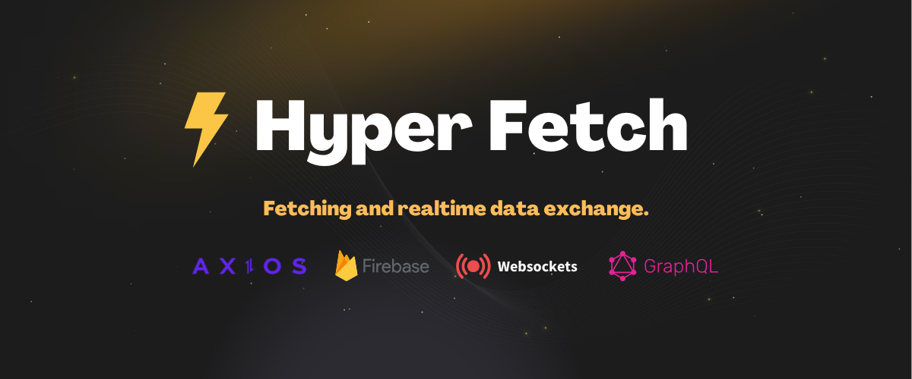
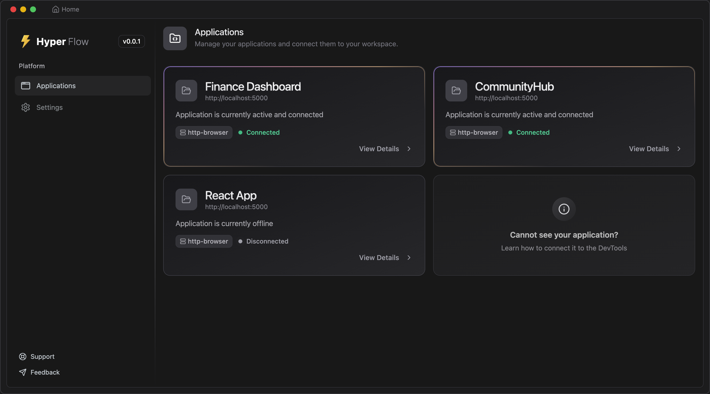

[](/blog/hyper-fetch-7-0)

> Version 7.0 is not just an update - it's a complete reimagining of the developer experience. We've listened to your
> feedback and created tools that will fundamentally change how you build and debug data-driven applications. We've
> modernized the entire library to provide a more robust and flexible data-fetching solution.

{/* truncate */}

:::success Key features

1. **HyperFlow**: A new standalone DevTool for real-time monitoring and debugging.
2. **Plugin System**: An extensible core that allows for community-driven features.
3. **ESLint Plugin**: Enforce best practices and catch issues early.
4. **New Documentation**: A complete overhaul of our documentation site with a focus on clarity, comprehensiveness, and
   interactivity.
5. **Sockets Rewrite**: A complete rewrite of the sockets implementation to be more flexible and easier to use.

:::

<LinkCard
  type="promo"
  title="Migrate to v7.0.0"
  description="Learn how to migrate your code to Hyper-Fetch 7.0."
  href="/blog/migrate-to-7-0"
/>

---

## What is Hyper Fetch?

**HyperFetch** is a powerful data-fetching framework that unifies various data sources like **Axios**, **GraphQL**, and
**Firebase** with platform-specific environments such as **React**, **React Native**, and **Electron**, offering a
seamless and consistent developer experience across all. What sets HyperFetch apart is its standardized approach to
handling data—whether you're using HTTP, Firebase, or GraphQL, the experience feels identical.

It fits projects of any size and adapts to a variety of workflows:

- For fast-paced development, it offers instant implementation with unmatched type safety.
- In larger projects, it brings process consistency and architectural uniformity that makes switching between codebases
  effortless.

It enforces best practices and ensures type safety across every aspect—responses, payloads, query parameters, URL
parameters, endpoint-specific and global errors. Beyond traditional requests, it also excels in real-time data handling
with full support for WebSocket-like communication using adapters for **WebSockets**, **Server-Sent Events**, and
**Firebase Realtime**, all with the same clean structure and robust type safety.

> There's simply no better way to structure your listeners and emitters to manage scalable realtime communication.

<LinkCard
  type="docs"
  title="Get Started"
  description="Learn how to write your first request with Hyper-Fetch."
  href="/docs/core/quick-start"
/>

---

## Highlights

### 1. HyperFlow DevTools

We are thrilled to introduce **HyperFlow**, a brand-new, standalone Electron application that provides a powerful and
intuitive UI for debugging and visualizing your Hyper-Fetch requests. It gives you a crystal-clear window into your
application's state in real-time.

- **Real-time Monitoring**: See all your requests, cache, and queue states as they happen.
- **Detailed Inspection**: Dive deep into individual requests to see their data, headers, and timings.
- **Easy Management**: Inspect and manage your cached data and request queues directly from the UI.
- **Data Visualization**: Visualize your data flows and understand how your app interacts with your APIs.

[](/blog/hyper-fetch-7-0)

### 2. Plugin System

The core of Hyper-Fetch is now extensible via a powerful new plugin system. This allows you and the community to build
new functionality on top of the library. The first official plugin is `@hyper-fetch/plugin-devtools`, which seamlessly
connects your application to the new **HyperFlow** DevTools.

<LinkCard
  type="integrations"
  title="Devtools Plugin"
  description="Meet the new Devtools plugin for Hyper-Fetch. It allows you to connect your application to the new HyperFlow DevTools."
  href="/docs/integrations/plugin-devtools"
/>

### 3. ESLint Plugin

To help you write better, more consistent code, we're releasing `@hyper-fetch/eslint-plugin-hyper-fetch`. This ESLint
plugin helps enforce best practices and avoid common pitfalls by catching potential issues before they become bugs.

```ts
// ❌ Typescript - leaving typos undetected
import { client } from "./client";

const request = client.createRequest<{
  response: ResponseType;
  paaayloaddd: PayloadType; // No error here, but it's a typo
}>()({ endpoint: "/" });

// code-editor-split

// ✅ Typescript + ESLint - catching typos before they become bugs
import { client } from "./client";

const request = client.createRequest<{
  response: ResponseType;
  // error-next-line
  paaayloaddd: PayloadType; // Error: "paaayloaddd" is not a valid property
}>()({ endpoint: "/" });
```

<LinkCard
  type="promo"
  title="Our ESLint Plugin"
  description="Our Eslint plugin allows you to avoid bugs and typos by catching them before they become bugs."
  href="/docs/integrations/plugin-eslint"
/>

### 4. New Documentation

We believe that great documentation is the key to a great developer experience. That's why we've completely overhauled
our documentation site with a focus on clarity, comprehensiveness, and interactivity.

- **New Structure**: We've reorganized our content into four main sections to help you find what you need faster:
  - **Docs**: For understanding core concepts.
  - **Guides**: Step-by-step tutorials for common use-cases.
  - **Integrations**: Detailed instructions for using Hyper-Fetch with other libraries and frameworks.
  - **API**: A comprehensive reference for our entire API.
- **Interactive Examples**: Many of our examples are now interactive, allowing you to play with the code directly in the
  browser.
- **Better Coverage**: We've expanded our documentation to cover more topics, with more in-depth explanations and
  examples.

#### Check out the new example

```ts live title="New code examples are now interactive"
import { postFile } from "./api";

const queuedRequest = postFile.setQueued(true);

const request1 = queuedRequest.send();
const request2 = queuedRequest.send();

console.log(await request1);
console.log(await request2);
```

---

## Breaking Changes

This release introduces several breaking changes. Please review them carefully before upgrading.

### 1. Object-Based Types

We've redesigned how request types are defined to improve readability and flexibility. Instead of a tuple-like generic,
you now use an object with named keys. This change allows you to provide only the types you need, in any order.

**Before (v6)**

```ts
import { client } from "./client";

const request = client.createRequest<ResponseType, PayloadType, LocalError, QueryParams>()({
  endpoint: "/",
});
```

**Now (v7)**

```ts
import { client } from "./client";

const request = client.createRequest<{
  response: ResponseType;
  payload: PayloadType;
  error: LocalErrorType;
  queryParams: QueryParams;
}>()({ endpoint: "/" });
```

:::tip ESLint Plugin

To help with this transition and prevent typos, we recommend using our new
[ESLint plugin](/docs/integrations/plugin-eslint/).

:::

### 2. Simplified Client Creation

The `new Client()` constructor is now deprecated. Use the new `createClient()` function instead. The
`client.createRequest()` method also features an improved and more fluent API for building your requests.

**Old:**

```ts
import { Client } from "@hyper-fetch/core";

const client = new Client({
  url: "https://api.example.com",
});
```

**New:**

```ts
import { createClient } from "@hyper-fetch/core";

export const client = createClient({
  url: "https://api.example.com",
});
```

### 3. Sockets Rewrite

The socket implementation has been completely rewritten. We now provide two separate, more focused adapters for
**Server-Sent Events** (`@hyper-fetch/socket-adapter-sse`) and **WebSockets** (`@hyper-fetch/socket-adapter-ws`).

<LinkCard
  type="docs"
  title="Sockets"
  description="Learn how to use the new sockets implementation in Hyper-Fetch."
  href="/docs/sockets/quick-start"
/>

### 4. Better Defaults

We've improved the default behavior of the library to be more intuitive and consistent. It touches  
the most notable change is the default behavior of the `cacheTime` and `staleTime` options.

We made sure that deduplication works as expected while still allowing you to adjust its behavior.

---

## Other Changes

- **Improved Caching**: We've introduced `cacheTime` and `staleTime` options for more granular control over caching,
  similar to what you might find in other popular data-fetching libraries.

- **ESM-only**: To align with the broader JavaScript ecosystem, HyperFetch is now an ESM-only library. You will need to
  ensure your build system can handle ESM packages.

- **Default HTTP Adapter**: The default HTTP adapter is now included in `@hyper-fetch/core`. You no longer need to
  install a separate adapter for basic HTTP requests.

- **Updated Adapters**: All adapters (`axios`, `firebase`, `firebase-admin`, `graphql`) have been updated to be
  compatible with the new core changes.

---

## Special thanks ❤️

We would like to thank the wonderful community for participating in our journey, especially the people who contributed
significantly to testing and solving problems with us and giving us a lot of feedback, which is incredibly valuable.
Thank you for your time, help and support!

- [@shapel](https://github.com/shapel) For testing the library to the limits and giving us a lot of feedback.
- [@stnslvtvrn](https://github.com/stnslvtvrn) For great feedback on the state management and generic types which lead
  to the creation of the new generic typing system.
- [@stabback](https://github.com/stabback) For giving us a lot of feedback on the state management and related issues
  with great reproducible examples.
- [@lobor](https://github.com/lobor) For early feedback on the new release - making it stable and ready for production.

---

## What's Next?

This release builds a new foundation for Hyper-Fetch. The modernization of the core, the new plugin system, and the
focus on developer experience with tools like **HyperFlow** open up a world of possibilities. We are excited to continue
building on this foundation to bring you even more powerful features in the future.

:::success Roadmap

We are already working on the next improvements:

1.  **CLI with Code Generation**: A new command-line interface to streamline your workflow, with utilities and code
    generators for requests, types, and even entire API clients from specifications like OpenAPI.
2.  **API SDKs Registry**: Inspired by `shadcn`, we are building a registry of pre-built SDKs for popular APIs like
    GitHub, Stripe, and Shopify that you can pull and use with a single command.
3.  **tRPC-like Type-Safe SDKs**: Generate fully type-safe client SDKs from your backend, enabling an end-to-end
    type-safe experience similar to `tRPC` but for any backend framework.
4.  **Unified Fetch Adapter**: A single, modern adapter based on the native `fetch` API for all HTTP-based requests,
    including REST and GraphQL, to simplify setup and ensure consistent behavior.

:::

Thank you for all the support. We can't wait to see what you build with **Hyper-Fetch 7.0**!
