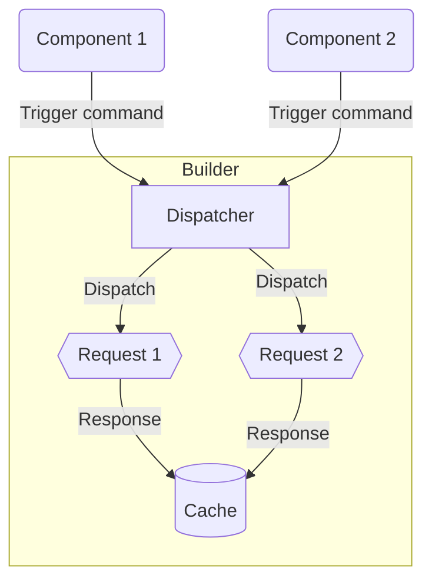
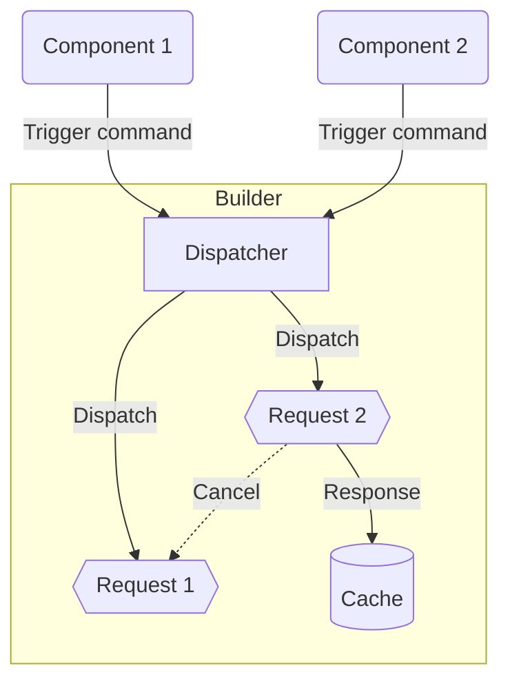
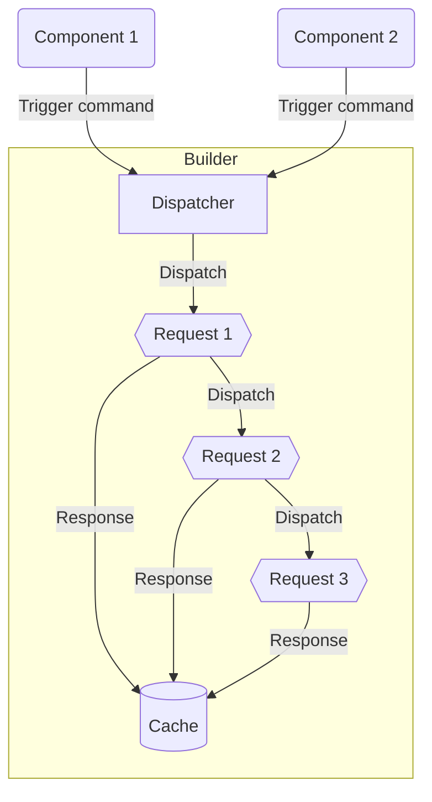
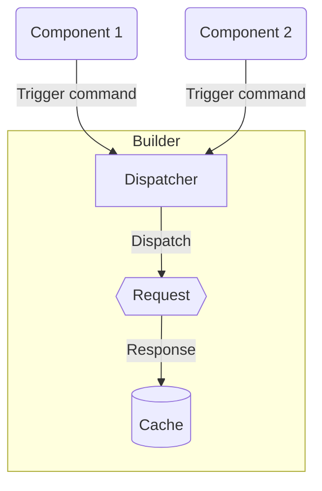

<a class="api-link" href="/api/Hyper-Fetch/Class/Dispatcher">
  <div class="api-link-title">Dispatcher</div>
  <div class="api-link-sub-title">Read the API Reference »</div>
</a>

---

## Introduction

**`Dispatcher`** is the place where all requests in our library go before being send (except those triggered directly in
the client). This is the place that handles the dispatch of requests and manages retries, queueing, offline handling,
canceling and deduplication and sending the received data to the cache. On the `builder` class you can find two
instances of the dispatcher, one for fetching and one for submitting requests. This is made due to the configuration
reasons, which gives much more flexibility for you to later on.

Every request in the dispatcher is stored in the queue structure. This allows us to make many operations on the
dispatched requests - like stop, pause or start operations. Queue structure does not mean that all requests will be send
only one-by-one, in fact there are multiple dispatching modes available for you. Read about them in the
[dispatching modes](#dispatching-modes) section.

---

## Purpose

- `Flow handling` for the requests
- `Queueing` requests in the storage
- `Emitting` the results of the requests

---

## QueueKey

**`queueKey`**, which is kept on the instance of the Command being used, plays an important role in the queues. QueueKey
value is automatically determined by default based on parameters such as the method, endpoint and query params of the
given command, but there is nothing to prevent you from adding the key manually when setting the Command or using one of
its methods. This key is used to propagate and receive request events on the given queue and to manage requests which
goes in and goes out. The automatically generated queueKey is a combination of method, endpoint and query params.

---

## RequestId

**`requestId`** is autogenerated by the dispatchers when request is added to it. It's used in many cases when we need
exact communication with the dispatched requests. For example if we want to listen to the exact request emitted events.

```tsx
const requestId = builder.fetchDispatcher.add(command);

builder.commandManager.events.onUploadProgressById(requestId, console.log);
builder.commandManager.events.onDownloadProgressById(requestId, console.log);
```

---

## Features

### Queueing

Queues can be `stopped`, `paused`, or `started`. The difference between stop and pause is very small, when using stop,
requests that are in progress will be canceled (we do not remove them from the queue), while during pause, requests in
progress will be completed and the rest will be suspended.

### Queue - Pausing / Stopping / Starting

You can `stop`, `pause` and `start` all groups of requests using their `queueKey`. The difference between `stop` and
`pause` is simply that stop cancel already started requests and pause let them be finished but the new requests will not
be dispatched.

```tsx
builder.fetchDispatcher.stop("my-queue-key");
builder.fetchDispatcher.pause("my-queue-key");
builder.fetchDispatcher.start("my-queue-key");
```

### Request - Stopping / Starting

You can stop and start individual requests with `stopRequest` and `startRequest` method. Stopped request is getting
simply cancelled and waits in the dispatch queue until it starts again.

```tsx
builder.fetchDispatcher.stopRequest("my-queue-key", "requestId");
builder.fetchDispatcher.startRequest("my-queue-key", "requestId");
```

### Offline

When the connection is lost, the queue is stopped and the failed or interrupted requests will wait for the connection to
recover. In this way, we are sure that our data will not be lost.

### Lifecycle

Queues have optional options with events that are fired at certain moments of their lifecycle. These are events such as
`onUpdateStorage` and `onInitialization`.

---

## Dispatching Modes

Every dispatcher queue have several modes to be selected by command props.

### Concurrent

While using it, requests are not limited in any way, they can all be called at any time, all at once. This is basic and
the default mode for the commands.

It is setup by the command `queued` prop set to false.



### Cancelable

With cancelable mode we can avoid race-conditioning when multiple requests are getting send at the same time, but only
last matters for us. This mode is working perfectly in the paginated lists of data, where only single page need to be
shown at once, no matter if user is triggering new requests with rapidly changing pagination.

It is setup by the command `cancelable` prop set to true.



### Queued

If you're looking for `one-by-one` sending solution, this mode is perfect for that. It allows you to combine requests
into one ordered list that will be resolved one by one. What's more - it will give you the possibilities to `start`,
`stop`, `pause` the whole queue.

It is setup by the command `queued` prop set to true.



### Deduplication

Deduplication plays a great role in optimizing the data exchange with the server. If we ask the server for the same data
twice at the same time, or during the request, we will perform only single call, but request will be propagated to the
both sources.

It is setup by the command `deduplication` prop set to true.



---
