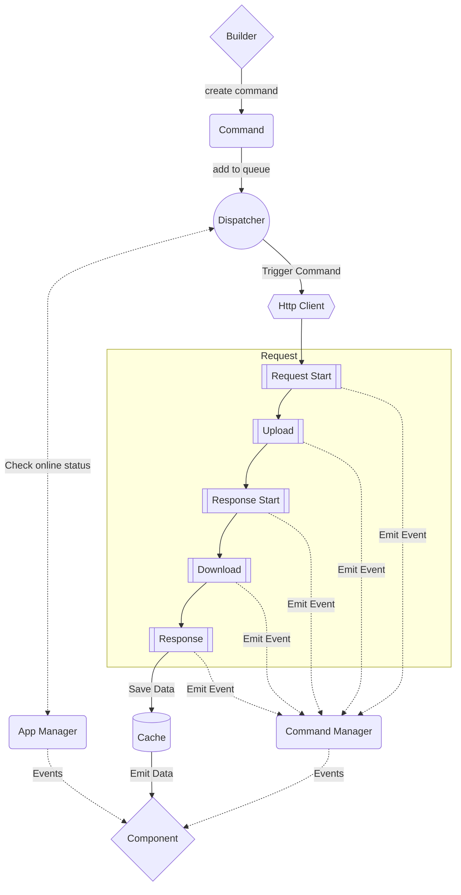

We try to provide the deepest possible knowledge about the architecture of our library to encourage you to write any
adapters, plugins and additions to our library.

## General Flow

The flow of the request through the Hyper Fetch system is presented below. We show there the steps shown from the moment
of adding a command to the dispatcher to passing data to the component.

