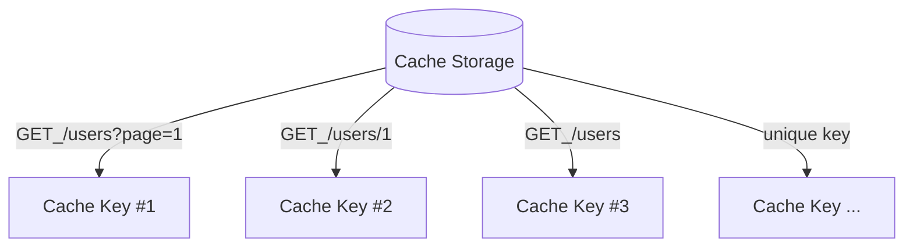
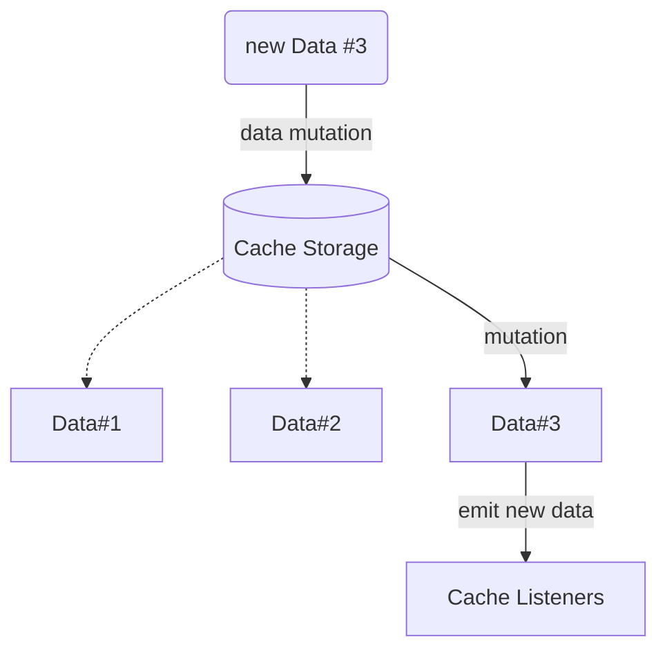

We try to provide the deepest possible knowledge about the architecture of our library; feel free to write any adapters, plugins, or additions.

---

## Full Flow

The flow of a request through the Hyper Fetch system is presented below.
The steps from the moment of adding a command to the dispatcher to passing data to the component are included.

---

## Cache

The cache saves data under `cacheKey` values, which allows us to easily use it.

#### Response event flow

The diagram below shows how mutation is propagated in our system.

