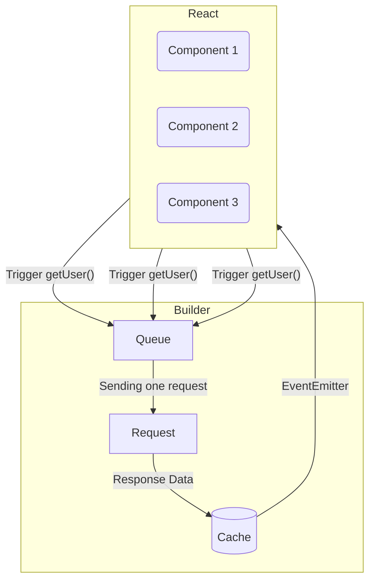

:::note

This section is currently **Work in Progress**. It will be ready for version 1.0.0 of Hyper Fetch.

:::

### Deduplication

```mermaid
flowchart TD;
    subgraph React
      Component_1
      Component_2
      Component_3
    end
    subgraph Builder
      Queue
      Cache
      Request
    end
    Component_1(Component 1);
    Component_2(Component 2);
    Component_3(Component 3);
    Queue -- Sending one request --> Request[Request]
    React -- "Trigger getUser()" --> Queue
    React -- "Trigger getUser()" --> Queue
    React -- "Trigger getUser()" --> Queue
    Request -- Response Data --> Cache[(Cache)];
    Cache -- EventEmitter --> React
```
