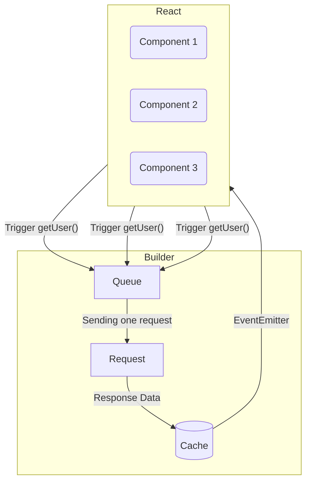

:::note

This section is currently **Work in Progress**. It will be ready for version 1.0.0 of Hyper Fetch.

:::

### Deduplication

<!-- - dwie kolejki:
  - submit
  - fetch
Powód kolejek i rozdzielenie:
  - Wysyłka i pobieranie działają inaczej.
  - Przy fetchu/pobieraniu chcemy ograniczyć liczbę wysyłanych requestów i deduplikować je.
  - Przy submicie nie możemy ograniczać liczby wysłanych requestów bo może spowodować to różne błędy i desynchronizację stanu.

Submit ma trzy tryby wysyłki:
 - kolejkowany -> wychodzi jeden po drugim
 - cancellowalny -> możliwość anulowania requestów jeśli wysyłasz dziesiątki takich samych requestów w jednym momencie.
 - wszystko na raz -> wszystko leci jak chce
 <- zmiana możliwa na poziomie gotowej komendy poprzez namespace

Submitową kolejkę można zatrzymywać (jest coś takiego jak stop i pause):
  - Pauza zatrzymuje działanie kolejki i nie cancelluje żadnych requestów, które obecnie trwają.
  - Stop powoduje zatrzymanie wysylki i cancell wszystkiego co jest obecnie wysyłane.

Obie mają obsługę offline. W momencie utraty połączenia z internetem kolejki są zatrzymywane a requesty wznawiane po wznowieniu połączenia.

FetchQueue -> działa cały czas, nie można go zatrzymywać lub wznawiać.
# TODO - powinno móc się zatrzymywać i wznawiać pobieranie. -->
