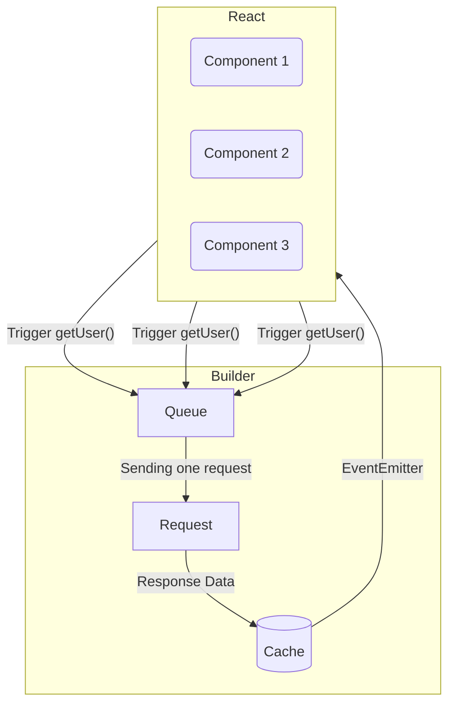

**`Queue`** is one of the `hyper fetch` queues. This is the place that handles the dispatch of requests and manages
their retries, offline handling, canceling and deduplication, up to sending the received data to the cache. On the
`builder` class you can find two instances of the queues, one for fetching and one for submitting. This is made due to
the configuration reasons, which gives much more flexibity.

Queues can be `stopped`, `paused`, or `started`. The difference between stop and pause is very small, when using stop,
requests that are in progress will be canceled (we do not remove them from the queue), while during pause, requests in
progress will be completed and the rest will be suspended.

## QueueKey

**`queueKey`**, which is kept on the instance of the Command being used, plays an important role in the queues. QueueKey
value is automatically determined by default based on parameters such as the method, endpoint and query params of the
given command, but there is nothing to prevent you from adding the key manually when setting the Command or using one of
its methods. This key is used to propagate and receive request events on the given queue and to manage requests which
goes in and goes out. The automatically generated queueKey is a combination of method, endpoint and query parmas.

## Lifecycle

Queues have optional options with events that are fired at certain moments of their lifecycle. These are events such as
`onUpdateStorage` and `onInitialization`.

## Offline

When the connection is lost, the queue is stopped and the failed or interrupted requests will wait for the connection to
recover. In this way, we are sure that our data will not be lost.

## Queue Modes

This queue have three modes of requesting.

#### 1. Concurrent

In this mode, requests are not limited in any way, they can all be called at any time and be deduplicated. This is the
basic type of action and will work in most basic cases.

#### 2. Cancelable

This mode works best for paginated lists. Thanks to it, we will not have problems with race-condition, the data we asked
about recently will be returned to us.

#### 3. Queued

If we want to send requests `one by one`, this mode will be great. It allows you to combine different types of requests
into one ordered list.

## Deduplication

Deduplication is one of the most important elements here and plays a large role in optimizing the data exchange with the
server. Mutation requests in deduplicated queue are highly inadvisable, it can, for example, lead to desynchronization
between the server and the application.

