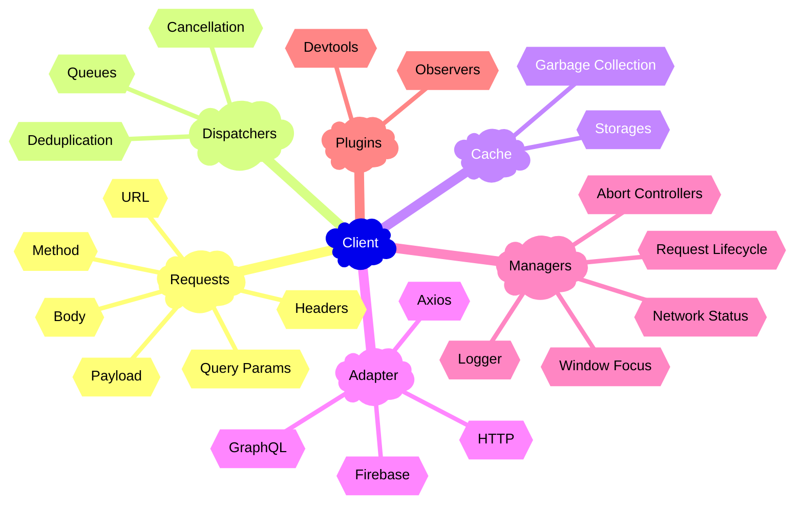

[Read the API Reference »](/api/core/Classes/Client.mdx)

**`Client`** is the central class for configuring your server connection in Hyper Fetch. It initializes all core
subsystems—such as queues, cache, and interceptors—and provides a unified way to create and manage requests based on its
configuration. By keeping all data and logic encapsulated within a single client instance, you ensure that each client
remains isolated and independent from others.

:::info Purpose

1. **Builder for all of the requests**
2. Central place for all the default **settings**
3. Handles **authentication** and **interceptors**
4. Place where all sub-modules are initialized

:::

---

## Initialization 🚀

The client is initialized with the `createClient` function.

```tsx
import { createClient } from "@hyper-fetch/core";

// highlight-start
export const client = createClient({ url: "http://localhost:3000" });
// highlight-end
```

<LinkCard
  type="guides"
  title="More about setup"
  description="Learn different ways and options to initialize the client"
  to="/docs/guides/core/01-basic/setup.mdx"
/>

---

## Available methods

(@import core Client type=methods&display=table)

<LinkCard
  type="api"
  title="Detailed methods docs"
  description="Check all available methods and their descriptions"
  to="/docs/api/core/Classes/Client#methods"
/>

---

## Features ✨

Here are some of the most important features available in the Client class.

:::note Builder approach

The `Client` is designed to be used as a builder of requests, serving as the global entry point for server communication
throughout your application. This approach prevents duplicated logic, promotes a consistent architecture, and makes it
easier to maintain and test your code by centralizing configuration and types.

:::

### 1. createRequest()

The `createRequest` method is the main method for creating requests. We use the builder pattern to create a request
object.

Each request keep the reference to the client, so it can access the global settings and interceptors.

```tsx
import { createClient } from "@hyper-fetch/core";

const client = createClient({ url: "http://localhost:3000" });

// highlight-next-line
export const getUser = client.createRequest<{ response: User }>()({ endpoint: "/users/1" });
```

<LinkCard type="docs" title="Request" description="More about the request and how to use it" to="/docs/core/request" />

### 2. Authentication

To send authenticated requests, set up the `onAuth` interceptor. Set up the request with the `auth` option set to
**true**.

```tsx
import { createClient } from "@hyper-fetch/core";
import { store } from "./store"; // Your state management store

// highlight-start
export const client = createClient({ url: "http://localhost:3000" }).onAuth((request) => {
  // Get the auth token from your store
  const state = store.getState();
  const authToken = state.auth.token;

  // highlight-next-line
  // Add the token to the request headers
  return request.setHeaders({
    ...request.headers,
    Authorization: `Bearer ${authToken}`,
  });
});
// highlight-end

// highlight-next-line
// Create an authenticated request
export const getUsers = client.createRequest()({
  endpoint: "/users",
  auth: true, // This enables the onAuth interceptor
});
```

<LinkCard
  type="guides"
  title="Authentication guide"
  description="Learn how to set up authentication for your application"
  to="/docs/guides/core/01-basic/authentication.mdx"
/>

---

### 3. Interceptors

Interceptors are a powerful feature that allows you to modify requests before they're sent or responses before they are
processed within other core modules.

They can modify the request before it's sent or the response after it's received, depending on the type of interceptor.

#### Request Interceptor

1. `onRequest()` - allows to modify the request before it's sent giving ability to modify its data
2. `onAuth()` - allows to modify the request with `auth: true` before it's sent, giving ability to pass custom auth
   headers or other any options

#### Response Interceptor

There are several methods for intercepting a response from a request:

1. `onResponse()` - intercepts any response after it's received to modify it's body
2. `onError()` - intercepts the error response after it's received to modify it's body
3. `onSuccess()` - intercepts the success response after it's received to modify it's body

We can modify received data with these interceptors before it will be emitted to other sub-systems.

```tsx
import { createClient } from "@hyper-fetch/core";

export const client = createClient({ url: "http://localhost:3000" })
  // Add request interceptor
  // highlight-start
  .onRequest((request) => {
    // Add custom headers to all requests
    return request.setHeaders({
      ...request.headers,
      "x-custom-header": "custom-value",
    });
  })
  // highlight-end
  // Add response interceptor
  // highlight-start
  .onResponse(async (response, request) => {
    // Log all responses
    console.log(`Response for ${request.endpoint}:`, response);
    return response;
  })
  // highlight-end
  // Add error interceptor
  // highlight-start
  .onError(async (errorResponse, request) => {
    // Handle specific error responses
    if (errorResponse.status === 401 && !request.used) {
      // Implement token refresh logic
      return request.setUsed(true).send();
    }
    return errorResponse;
  });
// highlight-end
```

<LinkCard
  type="guides"
  title="Interceptors guide"
  description="Learn how to set up interceptors for your application and when they can be used"
  to="/docs/guides/core/01-basic/interceptors.mdx"
/>

---

### 4. Global settings

Every module is initialized inside of the `Client` class. This is a perfect place to store and control global settings
for the adapter, cache, requests or other modules.

```tsx
import { createClient } from "@hyper-fetch/core";

// highlight-start
export const client = createClient({
  url: "http://localhost:3000",
  // Global settings for all requests
  requestConfig: {
    timeout: 10000, // 10 seconds timeout for all requests
    retries: 3, // Retry failed requests 3 times
    retry: {
      methods: ["GET", "POST"], // Only retry GET and POST requests
    },
  },
  // Cache settings
  cache: {
    cacheTime: 5 * 60 * 1000, // Cache data for 5 minutes
    staleTime: 60 * 1000, // Data becomes stale after 1 minute
  },
});
// highlight-end

// These global settings can be overridden for specific requests
// highlight-next-line
export const getUser = client.createRequest()({
  endpoint: "/users/:id",
  method: "GET",
  timeout: 5000, // Override the global timeout for this request
});
```

<LinkCard
  type="guides"
  title="Global defaults guide"
  description="Learn how to set global defaults for the client and requests"
  to="/docs/guides/core/01-basic/global-defaults.mdx"
/>

---

### 5. Plugins

Plugins are a powerful feature that allows you to extend the functionality of the client. They can be used to listen to
the events happening inside of the Hyper Fetch.

```tsx
import { createClient } from "@hyper-fetch/core";
import { Plugin } from "@hyper-fetch/core";
import { devtoolsPlugin } from "@hyper-fetch/plugin-devtools";

// highlight-start
// Add the official devtools plugin
export const client = createClient({ url: "http://localhost:3000" })
  .setDebug(true)
  .addPlugin(
    devtoolsPlugin({
      appName: "My Application",
    }),
  );
// highlight-end

// Create a custom plugin
const loggingPlugin = new Plugin({
  name: "logging-plugin",
})
  .onRequestStart(({ request }) => {
    // highlight-next-line
    console.log(`Request started: ${request.method} ${request.endpoint}`);
  })
  .onRequestSuccess(({ response, request }) => {
    // highlight-next-line
    console.log(`Request succeeded: ${request.method} ${request.endpoint}`, response.data);
  })
  .onRequestError(({ response, request }) => {
    // highlight-next-line
    console.error(`Request failed: ${request.method} ${request.endpoint}`, response.error);
  });

// highlight-next-line
// Add the custom plugin to the client
client.addPlugin(loggingPlugin);
```

---

### 6. Hydration

We can hydrate the client with the data from the server. This is a powerful feature that allows us to pass the data from
the server to the client for the SSR use cases.

```tsx
// Server-side code
import { createClient } from "@hyper-fetch/core";

// highlight-start
export const client = createClient({ url: "http://localhost:3000" });
const userRequest = client.createRequest()({ endpoint: "/users/1" });

// Fetch data on the server
const response = await userRequest.send();

// Dehydrate the response for client hydration
const dehydratedData = userRequest.dehydrate({ response });
// highlight-end

// Pass dehydratedData to the client (e.g., as props or through a global state)

// Client-side code
import { createClient } from "@hyper-fetch/core";
import { useFetch } from "@hyper-fetch/react";

// highlight-start
export const client = createClient({ url: "http://localhost:3000" });

// Hydrate the client with server data
client.hydrate([dehydratedData]);
// highlight-end

// In your React component
function UserProfile() {
  // Data will be available immediately from cache, no loading state needed
  // highlight-next-line
  const { data } = useFetch(client.createRequest()({ endpoint: "/users/1" }), {
    revalidate: false, // Prevent automatic refetching
  });

  return <div>{data?.name}</div>;
}
```

---

## TypeScript functionality

Most important type passed to the `createClient` is the error type. It is a global error type, being used like a default
for any request errors. It is later combined with the "local error" type of the requests creating the union. This way we
handle generic errors from the server (global) as well as some validation/business (local) errors for given endpoint.

:::warning Enhancing TypeScript DX

It is important to use the [eslint plugin](/docs/integrations/plugin-eslint/index.mdx) to get the best typescript
experience. We enhance the abilities of the object generics to provide you with the best possible DX.

:::

```tsx
import { createClient, AdapterType } from "@hyper-fetch/core";

// highlight-start
// Define your global error type
interface ClientErrorType {
  message: string;
  code: number;
}

const client = createClient<{ error: ClientErrorType }>();
// highlight-end
```

- `error` defines the global/default error type used in all the requests. It should consist of an `Error` type and your
  default `ServerErrorType`. It is propagated down to the `createRequest` method, serving as a default for the
  `globalError` type.

- `adapter` is the generic responsible for shaping options passed to the adapter. Most likely you will change it only
  when you provide [your custom adapter](/docs/guides/core/02-advanced/custom-adapter.mdx).

## Modules 🧩



<LinkCard
  type="docs"
  title="Request"
  description="Handles request template creation and execution."
  to="/docs/core/request"
/>

<LinkCard type="docs" title="Cache" description="Handles data storages and persistence." to="/docs/core/cache" />

<LinkCard
  type="docs"
  title="Adapter"
  description="Handles all requests within Client. Can be replaced with setAdapter method."
  to="/docs/core/adapter"
/>

<LinkCard
  type="docs"
  title="Dispatcher"
  description="Handles the requests deduplication and queueing."
  to="/docs/core/dispatcher"
/>

<LinkCard
  type="docs"
  title="Managers"
  description="Handles the logging systems, app focus and online state, additional events and cancellation of requests."
  to="/docs/core/managers"
/>

---
