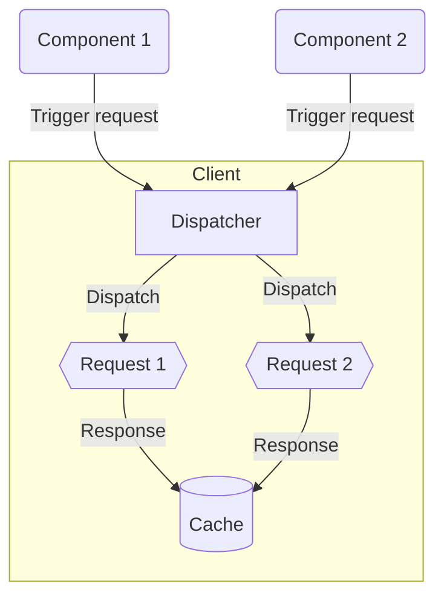
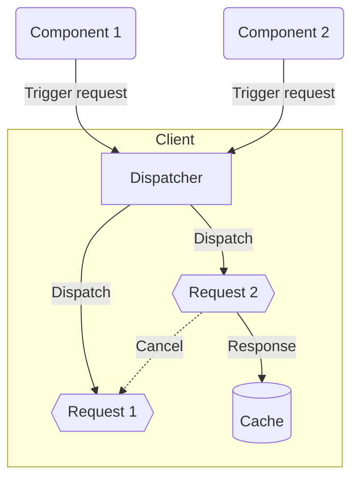
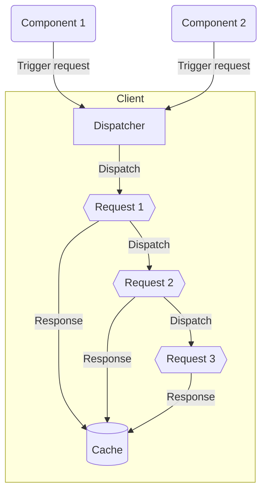
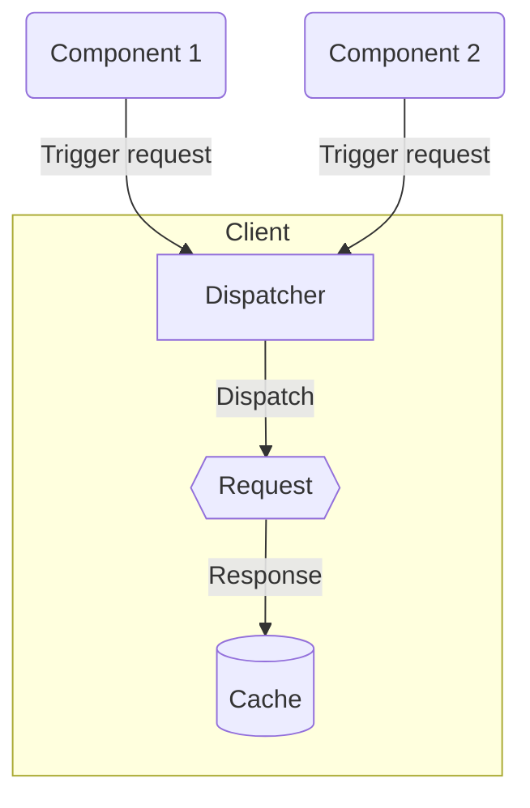

[Read the API Reference »](/api/core/Classes/Dispatcher.mdx)

---

## Introduction

All requests in this library (except those triggered directly in the adapter) go to the `dispatcher` before being sent.
The dispatcher handles request dispatch and manages retries, queueing, offline handling, canceling, deduplicating, and
sending the received data to the cache.

There are two dispatcher instances in the Client class: one for fetching and one for submitting requests. This was
designed for configuration reasons and gives you much more flexibility.

Every request in the dispatcher is stored in the queue structure. This allows us to perform many operations (e.g.
stopping, pausing, or starting) on the dispatched requests. However, this does not mean that all requests will be sent
individually; there are multiple dispatching modes available, which you can read about in the
[dispatching modes](#dispatching-modes) section.

---

## Purpose

- Handles request flow
- Queues requests in storage
- Emits request results

---

## QueueKey

**`queryKey`**, which is kept on the instance of the Request being used, plays an important role in queues. It is used
in propagation and reception of request events on a given queue and in management of incoming and outgoing requests. By
default, the queryKey value is automatically based on the method, endpoint, and query parameters of the given request.
However, you can add the key manually when setting the Request or using one of its methods.

---

## RequestId

**`requestId`** is autogenerated by the dispatchers when a request is added. It's used when we need exact communication
with the dispatched requests, e.g. if we want to listen to the exact request emitted events.

```tsx
const requestId = client.fetchDispatcher.add(request);

client.requestManager.events.onUploadProgressById(requestId, console.log);
client.requestManager.events.onDownloadProgressById(requestId, console.log);
```

---

## Features

### Queueing

Queues can be `stopped`, `paused`, or `started`. The difference between stop and pause is that stopping causes
in-progress requests to be canceled (but not removed from the queue), while pausing completes in-progress requests and
suspends waiting requests.

### Queue - Pausing / Stopping / Starting

You can `stop`, `pause` and `start` any group of requests using that group’s `queryKey`. Stopping cancels all started
requests; pausing completes in-progress requests and holds all others.

```tsx
client.fetchDispatcher.stop("my-queue-key");
client.fetchDispatcher.pause("my-queue-key");
client.fetchDispatcher.start("my-queue-key");
```

```tsx live
const a = 1;

function Component() {
  return <div>Hello</div>;
}
```

### Request - Stopping / Starting

You can stop and start individual requests with the `stopRequest` and `startRequest` methods. A stopped request is
canceled and must wait in the dispatch queue until it is started again.

```tsx
client.fetchDispatcher.stopRequest("my-queue-key", "requestId");
client.fetchDispatcher.startRequest("my-queue-key", "requestId");
```

### Offline

When the connection is lost, the queue is stopped and the failed or interrupted requests will wait for the connection to
recover. This prevents data loss.

### Lifecycle

Queues have optional options with events (such as `onUpdateStorage` and `onInitialization`) that are fired at certain
moments in their lifecycle.

---

## Dispatching Modes

Every dispatcher queue has several modes that can be selected by request props.

### Concurrent

When using this mode, requests are not limited in any way; they can all be called at any time, all at once. This is the
default mode for requests.

Enable this mode by setting the request `queued` prop to false.



### Cancelable

Cancelable mode avoids race-conditioning when multiple requests are sent simultaneously but only the last request
matters. This mode is ideal for paginated lists of data, i.e. where only a single page needs to be shown regardless if
the user is triggering new requests with rapidly changing pagination.

Enable this mode by setting the request `cancelable` prop to true.



### Queued

This mode is ideal for a `one-by-one` sending solution. It allows you to combine requests into one ordered list that
will be resolved one item at a time. In this mode, you can `start`, `stop`, or `pause` the entire queue.

Enable this mode by setting the request `queued` prop to true.



### Deduplication

Deduplication optimizes the data exchange with the server. If we ask the server for the same data twice at the same time
with different requests, this mode will perform one call and propagate the request to both sources.

Enable this mode by setting the request `deduplication` prop to true.



---
