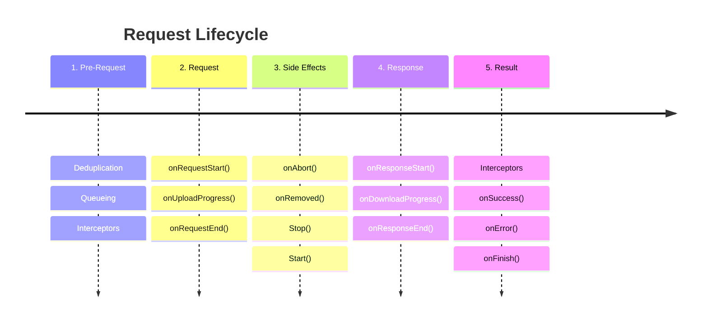

import { LinkCard } from "@site/src/components";

# Overview

> To truly understand the purpose of Hyper Fetch and the reasoning behind its design choices, it's helpful to explore
> the core principles that shape its development. Gaining insight into these foundations will help you decide if Hyper
> Fetch aligns with your project's needs.

> These are the core principles that shape the design of Hyper Fetch.

### Consistency for projects

In many projects, fetching data from APIs is handled differently, leading to a lack of consistency across codebases.
This inconsistency makes it harder for developers to onboard and understand the code, increasing both learning time and
maintenance costs. Often, teams reinvent fetching logic from scratch for each project, which not only wastes effort but
also makes it difficult to achieve uniformity even within a single project.

<LinkCard
  type="docs"
  title="Development"
  description="Development tips for using Hyper Fetch"
  to="/docs/getting-started/development"
/>

Furthermore, the absence of type safety in many fetchers can introduce subtle bugs and runtime errors, causing
significant issues in production environments. By providing a standardized, typesafe approach to data fetching, Hyper
Fetch ensures consistency and reliability across all your projects.

```ts
import { client } from "./client";

type RequestParams = {
  response: { message: string };
  payload: { name: string };
  queryParams: { additionalParam: string };
  error: { code: number; message: string };
};

const someRequest = client.createRequest<RequestParams>({
  url: "/api/some-request/:id",
});

// ⛔ Typescript error, you must pass payload, params and query params
const { data, error } = await someRequest.send();

// ✅ Now it's ok
const { data, error } = await someRequest.send({
  data: {
    name: "John",
  },
  params: {
    id: "123",
  },
  queryParams: { additionalParam: "test" },
});
```

### Classes as a core building block

A class-based architecture underpins every important module, bringing several advantages to the table. Testing and
mocking become much simpler, which helps maintain code quality and reliability. When building stories for components
that use fetchers, the encapsulation of logic in reusable classes streamlines the process.

Accessing and manipulating data within these classes is also straightforward, making debugging and extending
functionality easier. This modular approach encourages reusability and maintainability throughout the codebase.

```tsx
import { client } from "./client";

const getUsers = client.createRequest<{ response: User[]; queryParams?: { search?: string } }>({
  url: "/api/users/:id",
  method: "GET",
});

console.log(getUsers.endpoint); // /api/users/:id

const getUser = getUsers.setParams({ id: "123" });

console.log(getUser.endpoint); // /api/users/123
console.log(getUser.requestOptions.endpoint); // /api/users/:id
```

### Request as a fetching template

Requests serve as the core templates for making API queries. With full type safety and explicit type definitions, your
data fetching logic remains robust and predictable. All essential elements of an API call endpoints, parameters,
payloads, methods, and more are accessible through a single, unified interface. This design streamlines the process of
writing tests, stories, and mocks, eliminating the need for custom hooks for every request.

Since requests can be executed outside the main application logic, advanced scenarios like server-side rendering (SSR)
become possible, allowing fetching logic to be shared between server and client.

```ts
import { useFetch } from "@hyper-fetch/react";
import { client } from "./client";

// Create a request which is a template for the request
const getUsers = client.createRequest<{ response: User[]; queryParams?: { search?: string } }>({
  url: "/api/users",
  method: "GET",
});

// Then modify it as you need
const getUsersWithSearch = getUsers.setQueryParams({ search: "John" });

// Use on server
const loader = async () => {
  const { data, error } = await getUsersWithSearch.send();

  return { data, error };
};

// Use on client
const Component = () => {
  const { data, error } = useFetch(getUsersWithSearch);

  return <div>{data?.response.map((user) => user.name)}</div>;
};
```

This flexibility empowers you to manage loading states and data flow more effectively across your application.

### Access to whole request lifecycle

Unlike many popular data fetching libraries, such as React Query or SWR, which are decoupled from the underlying
fetchers like Axios or the native Fetch API, Hyper Fetch provides comprehensive access to the entire request lifecycle.

Important information such as progress updates, abort signals, or authentication handling does not need to be
implemented manually for each project. This unified approach makes it easy to track when a request starts uploading,
when a response begins, or when the process completes.



As a result, powerful features like integrated devtools, detailed analytics, and enhanced logging are readily available,
contributing to a better developer experience and more maintainable applications.

:::note Unified lifecycle layer

Above timeline works for all integrations, including HTTP, GraphQL, Firebase, and more.

It gives unified layer for tracking it and managing exactly as you want.

:::

### Standardized API for all integrations

A unified API for interacting with server data is offered, regardless of the underlying technology be it HTTP, GraphQL,
Firebase, or any other integration. Every request is composed from the same set of building blocks, with consistent
properties such as endpoint, method, parameters, payload, and query parameters.

This standardization simplifies the learning curve for developers and makes it easier to switch between different
integrations without having to relearn new APIs. Maintaining and extending your codebase becomes more straightforward,
as you only need to implement a simple adapter interface to add new integrations.

This approach keeps your code clean, easy to understand, and highly maintainable, while also enabling rapid adoption of
new technologies as they emerge.

### Event-driven architecture

An event-driven architecture facilitates communication between modules, making it exceptionally easy to extend the
library with new features, such as custom devtools or advanced analytics.

This approach also integrates seamlessly with other tools, like the React hooks provided by Hyper Fetch, enabling you to
build live and realtime experiences with minimal effort. Modifying the core Client's cache is straightforward, allowing
you to create dynamic, responsive applications that can adapt to changing data in real time.

This flexibility and extensibility are key strengths, empowering you to build robust, feature-rich applications with
ease.

```tsx
import { client } from "./client";

// All events are available on the client sub modules
console.log(client.cache.events); // all emitters and listeners
console.log(client.fetchDispatcher.events); // all emitters and listeners
console.log(client.submitDispatcher.events); // all emitters and listeners
console.log(client.requestManager.events); // all emitters and listeners
console.log(client.appManager.events); // all emitters and listeners
// etc...
```

:::info Event-driven architecture

With this simple approach, we can redirect all events to other systems, such as devtools. At the same time, it serves
the internal logic of Hyper Fetch well and plays a significant role in its React implementation.

:::
