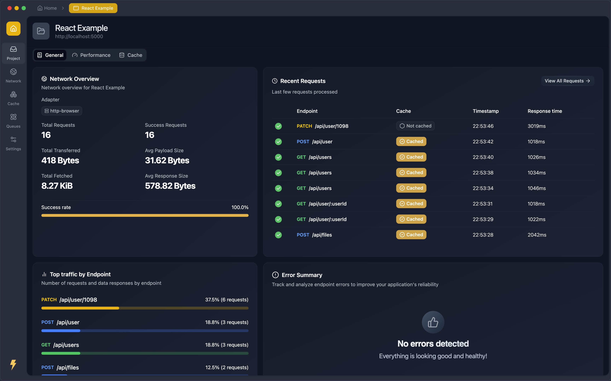
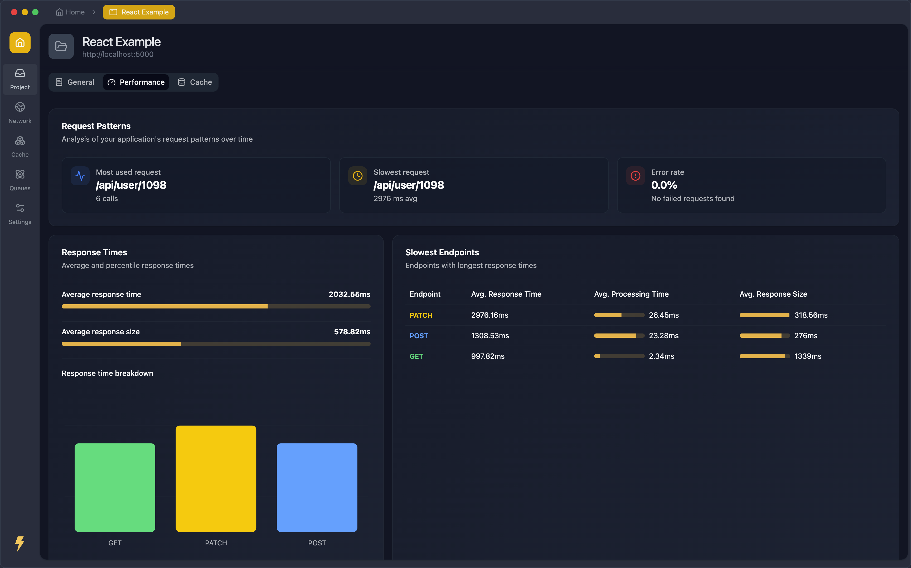
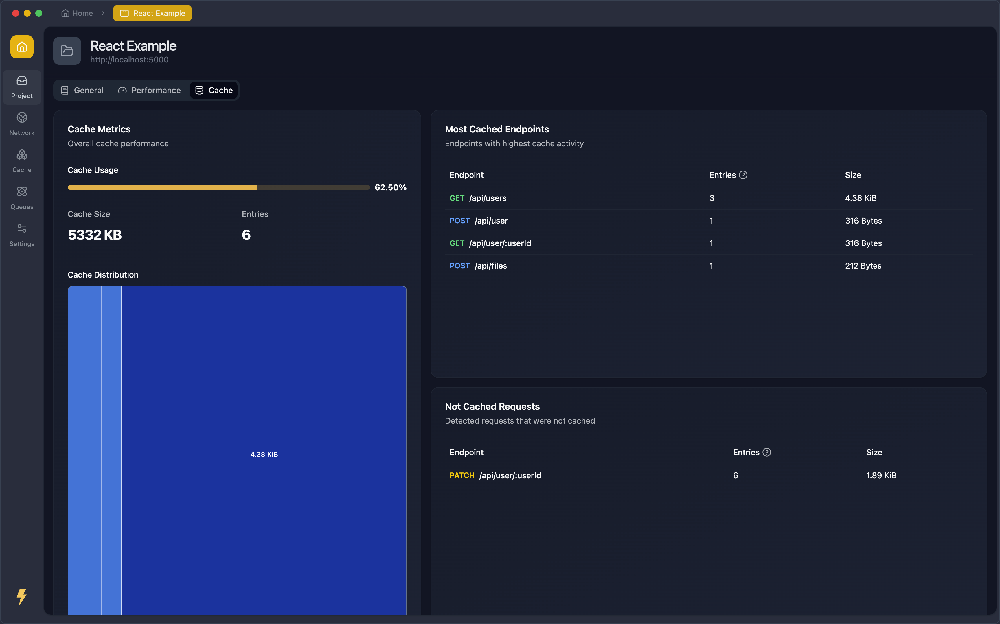
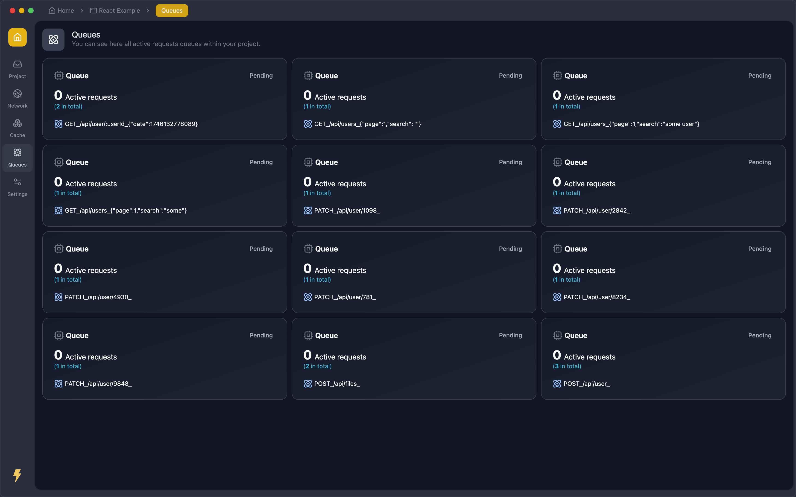
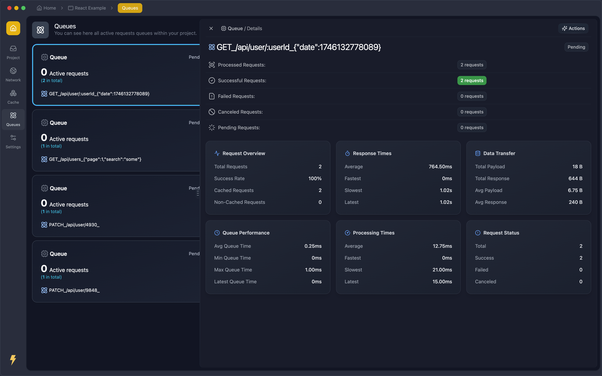
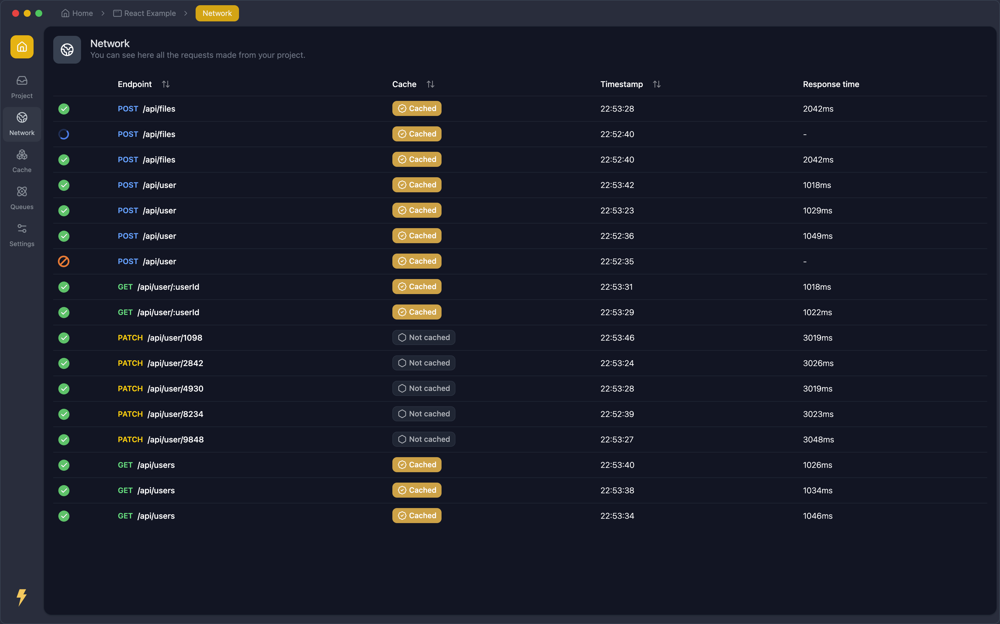
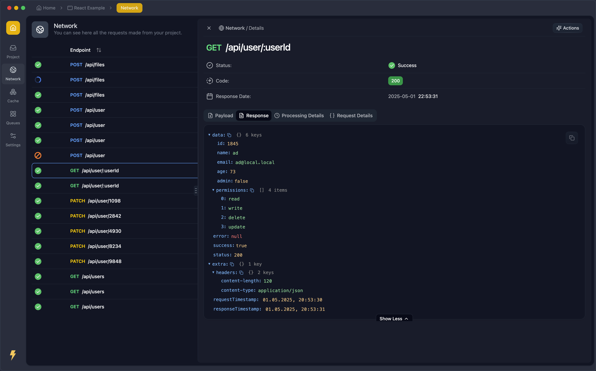
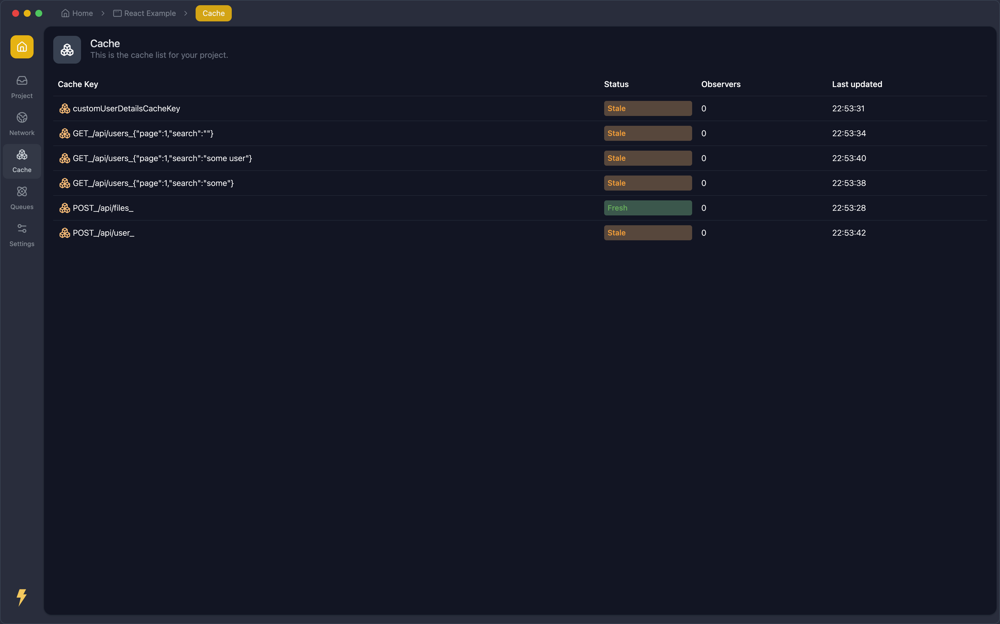
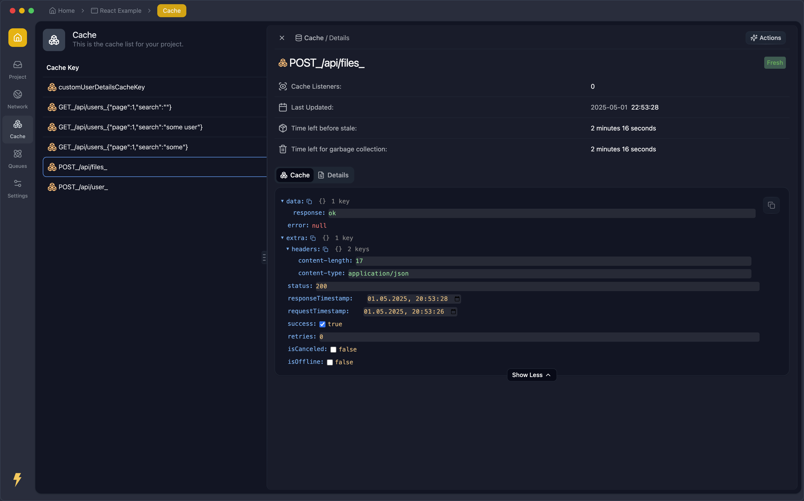
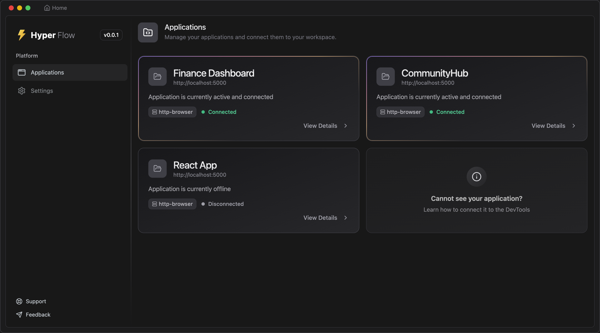

# 🚀 Welcome to Hyper Flow

> **Supercharge your development workflow with Hyper Flow — the ultimate DevTools suite for monitoring, debugging, and
> optimizing your application's network activity and cache.**

Hyper Flow, part of the Hyper Fetch ecosystem, empowers you to:

- **Visualize** your app's network and cache activity in real time
- **Debug** requests with ease
- **Optimize** performance and resource usage
- **Take control** of every request, queue, and cache entry

---

## 🌟 Why Hyper Flow?

Hyper Flow isn't just another DevTools panel. It's your command center for:

- **Seamless debugging**: Instantly inspect requests, payloads, and responses
- **Performance insights**: Identify bottlenecks and optimize your app
- **Cache mastery**: View, manage, and debug cache entries effortlessly
- **Queue management**: Oversee and control all request queues

---

## 🔍 Explore Hyper Flow Features

This is a list of all the features that Hyper Flow offers.

### 🗺️ Project Overview

 **See the big picture at a glance!**

Get instant clarity on your app's health with a beautiful dashboard that visualizes network and cache stats. Spot
trends, catch anomalies, and understand your application's behavior in seconds — no more guesswork!

### ⚡ Performance Insights

 **Uncover hidden bottlenecks and boost your
app's speed!**

Dive deep into request timings, throughput, and performance metrics. Hyper Flow helps you pinpoint slowdowns and
optimize your network layer for lightning-fast user experiences.

### 🗃️ Cache Management

 **Master your cache, maximize efficiency!**

Visualize, inspect, and control your cache like never before. Instantly see what's stored, what's stale, and what needs
attention — all in one place. Say goodbye to mysterious cache bugs!

### 📋 Queues List

 **Stay on top of every request!**

Monitor all your request queues in real time. Whether you're handling retries, priorities, or concurrency, Hyper Flow
gives you the power to manage and troubleshoot with confidence.

### 🔎 Queue Details

 **Zoom in for total control!**

Explore each queue's full history, status, and processing flow. Instantly debug stuck or failed requests and optimize
your queue strategies for flawless delivery.

### 🌐 Network Requests List

 **Never miss a network event!**

Watch every request as it happens. Filter, search, and analyze your app's traffic in real time — perfect for debugging,
QA, and performance tuning.

### 🧩 Network Request Details

 **See every byte, every header, every response!**

Drill down into individual requests to inspect payloads, headers, and responses. Instantly spot issues, validate
integrations, and ensure your API calls are rock solid.

### 🗂️ Cache List

 **Your cache, fully transparent!**

Browse all cached items, check their status, and manage them with a click. No more black-box caching — take full control
and keep your app running smoothly.

### 🔬 Cache Details

 **Debug and optimize with surgical precision!**

Examine every detail of specific cache entries. Track changes, debug issues, and fine-tune your caching strategy for
maximum performance.

### 🏠 Application Panel

 **Your DevTools HQ — all features, one place!**

Access a unified dashboard that brings together every Hyper Flow feature. Jump between panels, correlate data, and
command your app's network and cache with ease.

---

## ✨ Get Started with Hyper Flow

Ready to transform your debugging and optimization workflow? Dive into Hyper Flow and experience the next level of
developer productivity!
